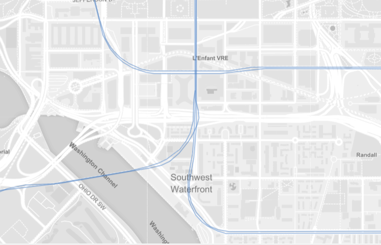
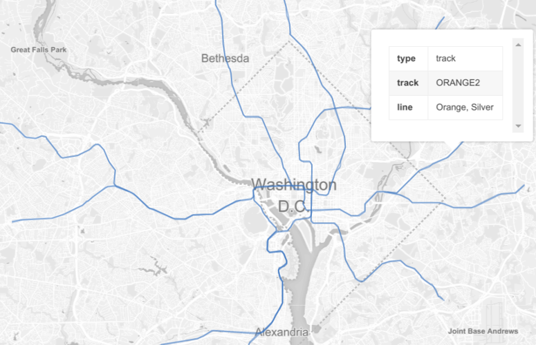

# WMATA Track Geospatial Data

Hi there. This is a WMATA Metro civic hack to produce a high-resolution map of Metro's tracks.

Preview the map: [Tracks.geojson](tracks.geojson)

I recorded real time train location data from the [WMATA Real Time Train Map](gis.wmata.com/metrotrain/index.html)
(which provides real time train lat/lng coordinates) every 15 seconds over the course of about two weeks and connected
the train location points to form line segments for each of the revenue tracks (i.e. not the yards, pocket tracks, 
side tracks, or spurs).

This was harder than it sounds. Metro trains don't have GPS devices. Their locations are known to WMATA
by which "circuit" they are currently traveling on. Each circuit is uniquely identified with a number (which
can be found in the [WMATA API](https://developer.wmata.com/docs/services/5763fa6ff91823096cac1057/operations/5763fb35f91823096cac1058)).
WMATA knows the location of every circuit, and so when a train passes over a circuit WMATA knows the train's
location by knowing the circuit's location. That seems to be how the real time train map works. When a train
is passing over a circuit, the train gets displayed at that circuit's location (at least, that's what it
appears to be doing).

But the real time data isn't consistent. Trains don't always appear to cross through every circuit on the tracks
(some circuits might not be operational, sometimes the trains may be moving so fast that a circuit is missed
between two snapshots 15 seconds apart). Trains also appear to move backwards sometimes when it [prematurely
triggers the next circuit ahead](https://developer.wmata.com/TrainPositionsFAQ). (I also tried to match up the
train locations from the real time map with the real time train position circuit numbers from the [official real time train position API](https://developer.wmata.com/docs/services/5763fa6ff91823096cac1057/operations/5763fb35f91823096cac1058)
(which publishes circuit numbers but not lat-lng coordinates), but the data was too inconsistent --- the two data
sources didn't line up enough to reliably match up the data.) So what we have is a bunch of points, with some
metadata about the trains running over them, but not what order trains actually traverse them in (i.e. how they connect).

This project puts the points in order. That's really all.

The revenue track paths are stored in [tracks.json](tracks.json). The complete Metro system is broken down into
track segments:

* RED1 (Glenmond-bound) and RED2 (Shady Grove-bound)
* ORANGE1 (New Carrolton to Vienna, New Carrolton-bound), ORANGE2 (Vienna-bound) (Blue and Silver share part of these tracks)
* BLUEA1 (Stadium to Largo, Largo-bound), BLUEA2 (Stadium-bound)
* BLUEB1 (Franconia to Alexandria, Alexandria-bound), BLUEB2 (Franconia-bound) (Yellow Rush Plus too)
* SILVER1 (Whiele to East Falls Church, East Falls Church-bound), SILVER2 (Whiele-bound)
* GREEN1 (Branch Ave to Greenbelt, Greenbelt-bound), GREEN2 (Branch Ave-bound) (Yellow shares part of these tracks)
* YELLOW1 (Huntington to L'enfant Plaza, L'enfant-bound), YELLOW2 (Huntington-bound) (Blue shares part of these tracks)

I also used scipy to interpolate the locations between observed train coordinates to create smooth curved tracks.
The interpolated paths are stored in [tracks.geojson](https://github.com/JoshData/wmata-track-locations/blob/master/tracks.geojson).

Neither the circuit locations nor the interpolated paths appear to be perfectly accurate.

I did this for revenue tracks only because the script works by assembling long segments of continuous track in
a way that keeps the track smooth, and the revenue tracks are long and easy to work with. The non-revenue tracks
are tiny and numerous, so I'll come back to that at another time.

